<div align="center">


# 👋 Hey, I'm Aditya


<p>


</p>

</div>

---

## 💫 About Me

```bash
$ whoami

Name        :: Aditya Bhalla
Role        :: Software Developer
Education   :: B.Tech CSE
Location    :: India

Current Focus
-------------
→ Building scalable web applications
→ Exploring AI & Local LLMs
→ Developing multiplayer systems
→ Creating games with Unity

Interests
---------
AI • Distributed Systems • Web Development
Game Development • Cybersecurity
```

- B.Tech CSE Student
- Software Developer
- AI Developer
- Unity Developer
- Learning every day

---

# ⚡ Tech Stack

### Languages

<p align="center">

</p>

### Frontend

<p align="center">

</p>

### Backend

<p align="center">

</p>

### Tools

<p align="center">

</p>

---

# 🚀 Featured Projects

<div align="center">

|                                                                  Project                                                                  | Description                                                                                                                                               | Tech                            |
| :---------------------------------------------------------------------------------------------------------------------------------------: | --------------------------------------------------------------------------------------------------------------------------------------------------------- | ------------------------------- |
| <a href="https://github.com/AdityaCodess/PhotonKey"></a> | High-fidelity Quantum Key Distribution mission design & simulation platform featuring orbital modeling, visualization, and secure communication analysis. | `Python` `Matplotlib` `Physics` |
|     <a href="https://groundzerohq.netlify.app"></a>     | Real-time multiplayer strategy engine with WebSockets, browser rendering, AI-powered gameplay and scalable networking.                                    | `Node.js` `WebSockets` `WebGL`  |
| <a href="https://github.com/AdityaCodess/AegisGRID"></a> | Predictive cybersecurity framework for critical infrastructure monitoring and intelligent anomaly detection.                                              | `Python` `AI` `Analytics`       |

</div>

---

# 📊 GitHub Stats

<p align="center">


</p>

<p align="center">

</p>

---

# ⏳ Weekly Development Breakdown

<!--START_SECTION:waka-->

```txt
Python       31 mins         ████████▒░░░░░░░░░░░░░░░░   33.40 %
YAML         14 mins         ████░░░░░░░░░░░░░░░░░░░░░   15.43 %
HTML         12 mins         ███▒░░░░░░░░░░░░░░░░░░░░░   13.65 %
JavaScript   10 mins         ███░░░░░░░░░░░░░░░░░░░░░░   11.75 %
Text         10 mins         ██▓░░░░░░░░░░░░░░░░░░░░░░   10.81 %
```

<!--END_SECTION:waka-->

---

# 📈 Activity Graph

<p align="center">

</p>

---

# 📊 GitHub Metrics

<p align="center">
  
</p>

---

# 🏆 GitHub Trophies

<p align="center">
  
</p>

---

# 🐍 Contribution Snake

<p align="center">

</p>

---

# 🌐 Connect

<p align="center">
<a href="https://github.com/AdityaCodess">

</a>

<a href="https://linkedin.com/in/aditya-jpsingh-bhalla">

</a>

<a href="mailto:adityabhalla2007@gmail.com">

</a>
</p>

---

<div align="center">

### ⭐ Code • Build • Break • Learn • Repeat


</div>
